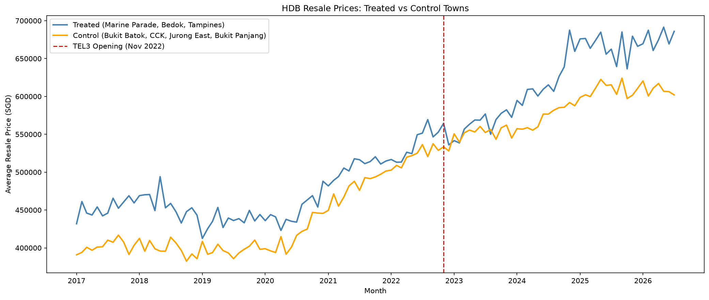
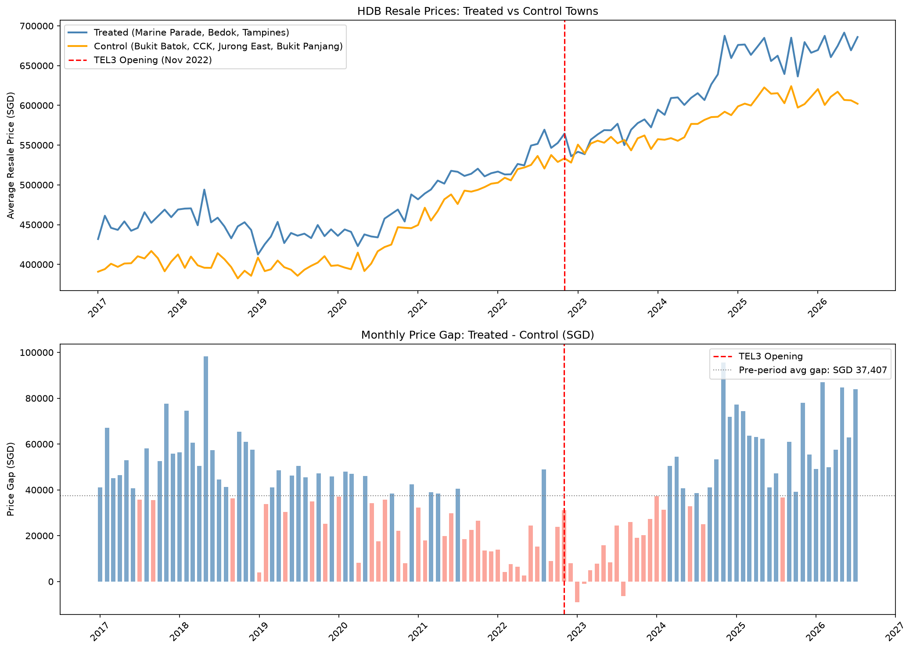

# Singapore HDB Resale Price — MRT TEL3 Causal Impact Analysis
**Did the Thomson-East Coast Line (TEL3) opening actually drive up nearby HDB prices?**

## Overview
MRT station openings are widely believed to boost nearby property prices.
This project applies **Difference-in-Differences (DiD)** to rigorously test whether the TEL3 opening (November 2022) caused a statistically significant price increase in nearby HDB towns — controlling for Singapore's broader market surge.

## Dataset
- **Source**: [HDB Resale Flat Prices — data.gov.sg](https://data.gov.sg/datasets/d_8b84c4ee58e3cfc0ece0d773c8ca6abc/view)
- **Period**: January 2017 – July 2026
- **Size**: 235,468 transactions
- **Event**: TEL3 opening — November 2022

## Study Design

| | Group | Towns |
|---|---|---|
| **Treated** | TEL3 nearby | Marine Parade, Bedok, Tampines |
| **Control** | TEL3 distant | Bukit Batok, Choa Chu Kang, Jurong East, Bukit Panjang |

DiD regression model:

    resale_price ~ treated + post + did + floor_area_sqm + lease_commence_date

where `did = treated × post` captures the causal effect of TEL3 opening.

## Key Findings
| Metric | Value |
|--------|-------|
| Treated group baseline premium | +SGD 94,279 (p<0.001) |
| Overall market surge (post-2022) | +SGD 140,470 (p<0.001) |
| **TEL3 causal effect (DiD)** | **SGD -942 (p=0.463)** |
| Pre-opening price gap | SGD 37,407 |
| Post-opening price gap | SGD 42,735 |
| Gap change | +SGD 5,328 |
| R-squared | 0.773 |

## Interpretation
TEL3 opening had **no statistically significant causal effect** on nearby HDB resale prices (p=0.463).
Singapore's broad market surge (+SGD 140,470, p<0.001) dominated any localized MRT effect.
While the price gap directionally widened by SGD 5,328 post-opening, this is insufficient to establish causality.

### Why a null result matters
A statistically insignificant result is not a failed analysis — it is a finding.
Selectively re-running analyses until p<0.05 is achieved (p-hacking) was deliberately avoided.
The pre-registered design: full 2017–2026 period, fixed treated/control towns, OLS DiD.

## Results

## Limitations
- TEL3 effect may be partially pre-priced in before the official opening date
- Town-level aggregation masks block-level proximity effects
- Parallel trends assumption may be violated given different town characteristics
- Singapore's 2022–2023 cooling measures and broader macro factors not fully controlled

## Tech Stack
- Python 3.12
- pandas, numpy, matplotlib
- statsmodels (OLS)

## Next Steps
- Block-level granularity analysis using exact distance to nearest MRT station
- Hedonic regression controlling for floor level, flat type, remaining lease
- Synthetic Control as alternative methodology
- Apply same framework to TEL4 opening (2024) as out-of-sample validation
